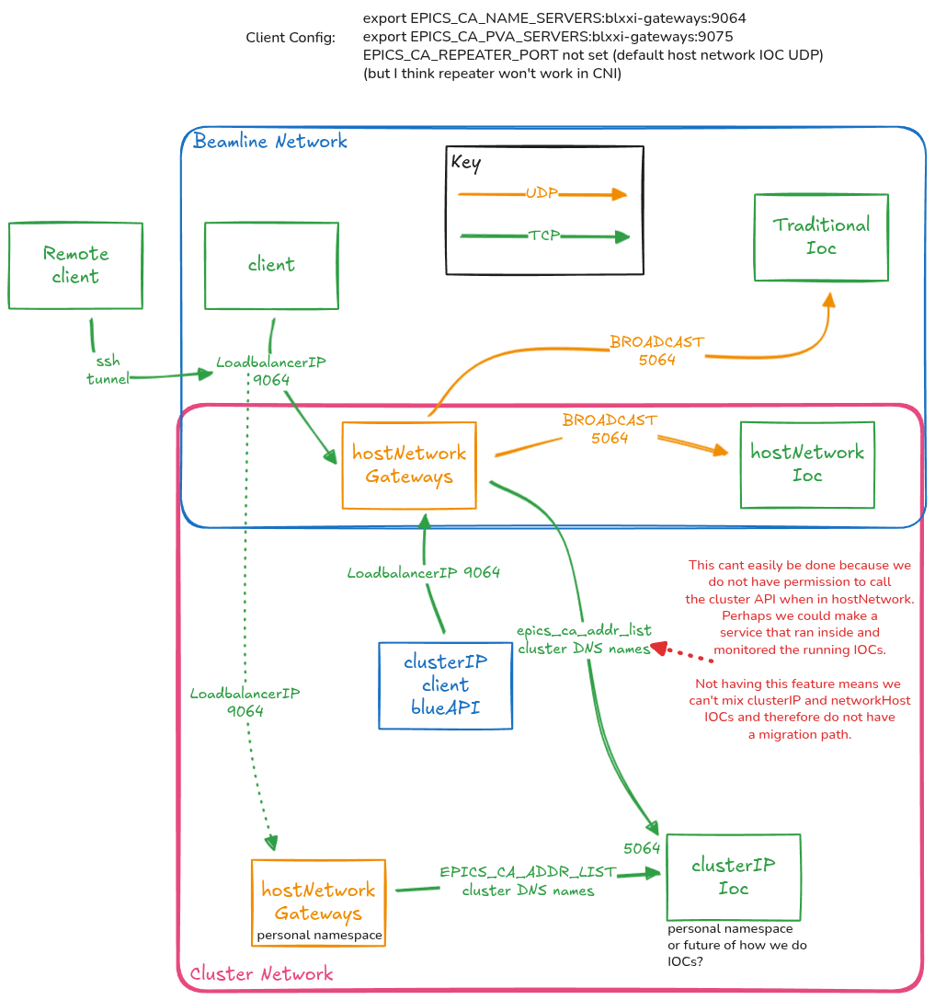

# gateways

A container for the epics PVA gateway and epics CA gateway.

Includes K8S script to determine the cluster IPs or DNS names of all IOCs in the namespace.

Configures the gateways to connect to all IOCs in the namespace.

When run with hostNetwork=true, the gateways use broadcast on the local network to discover IOCs.

When run with hostNetwork=false, the gateways use the cluster DNS names of the IOCs that were running when the gateways pod started - you are required to restart the pod if new IOCs are deployed.

At DLS the only configuration required in values.yaml is hostNetwork: false if you want to use the cluster DNS names of the IOCs.

This diagram is an overview of the two modes of operation:

